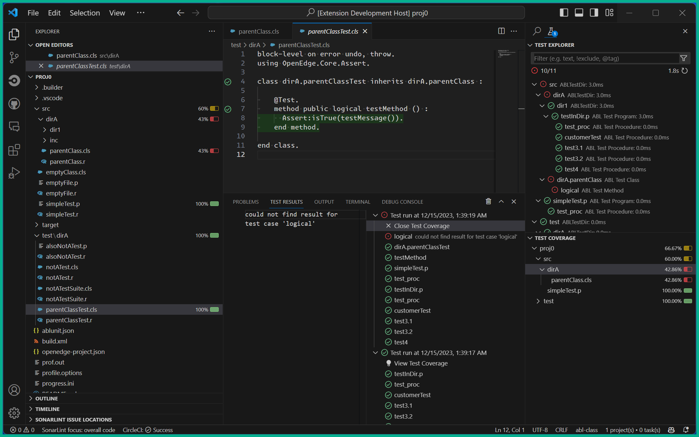

# ABLUnit Test Runner - Insiders Edition!  

The [ABLUnit Test Runner](https://github.com/kenherring/ablunit-test-provider/) VSCode extension integrates [ABLUnit tests](https://docs.progress.com/bundle/openedge-developer-studio-help-122/page/Learn-About-ABLUnit-Test-Framework.html) into the VSCode test explorer.

This branch, `insiders` exists to test and showcase this extensions usage of the [VSCode Test API](https://github.com/microsoft/vscode/issues/123713) ahead of it's official release.

See the [`main`](https://github.com/kenherring/ablunit-test-provider?tab=readme-ov-file#ablunit-test-runner---) branch of this repository for the latest stable release.

## Code Coverage via Native API

Here is a screenshot of what the current insiders build looks like when running tests with code coverage enabled:

