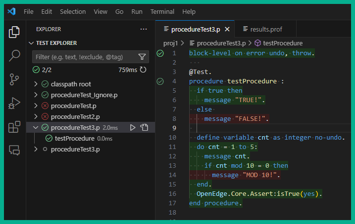

# ABLUnit Test Provider 

This VSCode test provider extension integrates [ABLUnit tests](https://docs.progress.com/bundle/openedge-developer-studio-help-122/page/Learn-About-ABLUnit-Test-Framework.html) into the VSCode test explorer.

This is my first VSCode extension, and my first TypeScript project. I'm sure there are many ways to improve the code, and I welcome any feedback.  I'm also open to collaboration if anyone is interested.

Quality code, and thus unit testing, is a passion of mine.  I hope this extension helps others to embrace [TDD](https://en.wikipedia.org/wiki/Test-driven_development) and improve their code.

## OpenEdge Versions Note

This project was developed using the [Progress OpenEdge Developers Kit: Classroom Edition](https://www.progress.com/openedge/classroom-edition).  That means it's only been tested against version 12.2 at the moment.  Feel free to report any bugs you may run into with other versions.

## Extension

### Features

* Run ABLUnit Tests
* See test results
* View code coverage

	

## Configuration

| Setting | Default | Description |
| --- | --- | --- |
| `ablunit.display.classLabel` | `classname` | `[ "classname" \| "filename" ]` |
| `ablunit.display.style` | `tree` | `[ "tree" \| "flat" ]` |
| `ablunit.files.include` | `**/*.{cls,p}` | Glob pattern to identify potential tests |
| `ablunit.files.exclude` | `**/.builder/**` | Glob pattern to exclude |
| `ablunit.findAllFilesAtStartup` | `true` | Search all workspace files for test cases.  It may be beneficial to disable this for large workspaces, in which case the extension will find tests as files are accessed. |
| `ablunit.notificationsEnabled` | `true` | Enable/disable notifications |
| `ablunit.importOpenedgeProjectJson` | `false` | import settings from `openedge-project.json` |
| `ablunit.params` | | Additional options/parameters passed to `_progres` |
| `ablunit.resultsPath` | See `ablunit.tempDir` | Output location for the xml generated by ABLUnit.  Typically `results.xml`.  This setting would typically be used with `ablunit.tests.command` |
| `ablunit.profileOptionsPath` | See `ablunit.tempDir` | See the [`-profile`](https://docs.progress.com/bundle/openedge-startup-and-parameter-reference-122/page/Profiler-profile.html) startup parameter |
| `ablunit.profileOutputPath` | See `ablunit.tempDir` | Output location for the `.prof` / `.out` file generated by the profiler.  Oftentimes `prof.out`.  This setting would typically be used with `ablunit.tests.command` |
| `ablunit.tempDir` | Extension storage area | Any files generated when running ABLUnit will be stored here.  It is also used for the [`-T`](https://docs.progress.com/bundle/openedge-startup-and-parameter-reference-122/page/Temporary-Directory-T.html) startup parameter |
| `ablunit.tests.command` | `_progres -b -p ABLUnitCore.p <...>` | This setting can be used to run tests with any existing shell command your tests are configured to run with.  Example: `ant test` |

<!--
| `ablunit.tests.command.useABLPluginCommand` | | |
| `ablunit.tests.task` | | |
-->

# Commands

| Command | Description |
| --- | --- |
| `ablunit.test.runActive` | Run tests in the active file |
| `ablunit.test.runAll` | Run all tests in the workspace |

<!-- TODO: how many of these can just use default commands? -->

## Contributing

### Running the Project

- Run `npm install` in terminal to install dependencies
- Run the `Run Extension` target in the Debug View. This will:
	- Start a task `npm: watch` to compile the code
	- Run the extension in a new VS Code window
- Run a test in the new VS Code window

## Links

* [Progress Documentation -> Progress Developer Studio for OpenEdge Online Help -> Run test cases from the command prompt](https://docs.progress.com/bundle/openedge-developer-studio-help/page/Run-test-cases-from-the-command-prompt.html)
* [Progress Documentation -> ABLUnit Annotations](// https://docs.progress.com/bundle/openedge-developer-studio-olh-117/page/Annotations-supported-with-ABLUnit.html) - Used w/ snippets
* [GitHub progress/ade](https://github.com/progress/ADE) - source files for OE code
